> [学习记录](mlsys_paper_reports.md)

# Benchmark_EXP

默认以 CogVideoX-2b 模型任务为例，测试不同注意力模块的加速情况。
由于使用 RTX 4090 测试，不是 Hopper 架构，不能选择 fa3, sta 测试。
benchmark 代码参考了 sage 的 example


测试对象为：sage2, sparge, sparge_fp8

baseline: torch backend flash_sdp

## 环境

-   Python 3.12(ubuntu22.04)

-   CUDA 12.4

-   PyTorch 2.6.0

    

-   **CPU**: 16 vCPU Intel(R) Xeon(R) Gold 6430

-   **RAM**: 120GB

-   **GPU**: RTX 4090(24GB)

## 分析

### Benchmark End-to-End

由于自己手头 GTX 1660S 有若干特性不能支持，线上租用算力平台不支持 **ncu** 分析，所以主要分析依据是 **nsys**。

下表是从 **CUDA GPU Kernel Summary** 摘出的比较突出的点。

Warmup 2 轮，Run 1轮，10 \* 2 + 50，NVTX 结果作为总耗时。

| Metrics                         | FA2 (baseline) |  Sage2   | Sparge (fp16) | Sparge (fp8) |
| ------------------------------- | :------------: | :------: | :-----------: | :----------: |
| Attn (%)                        |     53.7%      |  31.3%   |     32.2%     |    28.7%     |
| Attn (s)                        |     45.4s      |  19.5s   |     20.4s     |    17.4s     |
| direct_copy_kernel_cuda (times) |     10,835     |  10,885  |     12,385    |    12,385    |
| direct_copy_kernel_cuda (ms)    |     373.4ms    |  373.8ms |     840.8ms   |    841.2ms   |
| CUDAFunctor_add (times)         |     6,422      |  7,922   |     6,422     |    6,422     |
| CUDAFunctor_add (ms)            |     650.5ms    |  1,045ms |     650.5ms   |    650.0ms   |
| Total (s)                       |     85.4s      |  63.2s   |     64.3s     |    61.6s     |


占计算主要部分的 **Attn** 从占比和绝对数值上都优化到原本的二分之一。
同时摘出 Instance 最多的 **direct_copy_kernel_cuda** 和 **CUDAFunctor_add**，数据拷贝和加法。

主要优化的耗时就是 Attn 计算优化出来的耗时，不过由于需要提前处理信息，会增加如数据拷贝和加法等耗时

除了本身计算量的减少，也有 fp8 计算加速的优化。

**UPD.** cudaStreamSynchronize，cudaLaunchKernel 属于 CPU 的耗时，GPU都是异步。

### Benchmark Sequence Length

因为使用随机数据去做 Benchmark，Sparge 的默认参数，会导致 Sparge 为 0%。

Benchmark 记录耗时的方式是 flash_attn.utils.benchmark.benchmark.benchmark_forward

#### Sparsity 0%
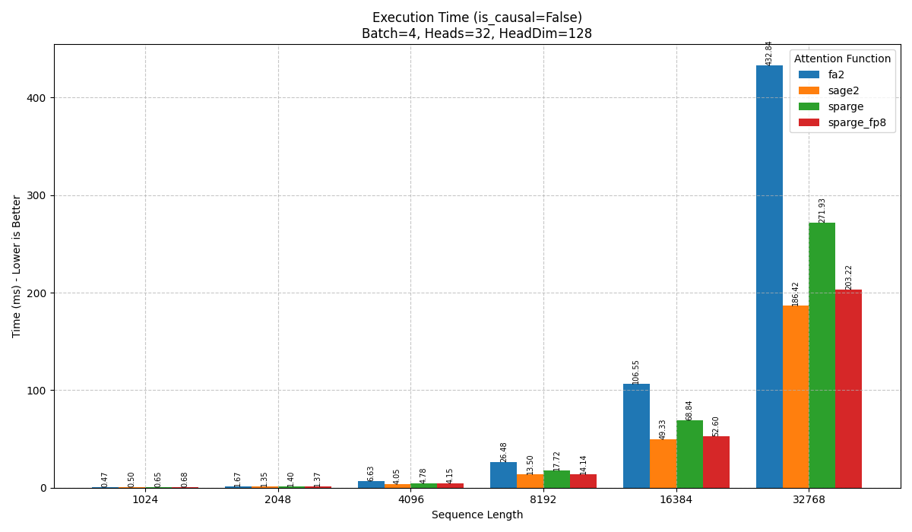
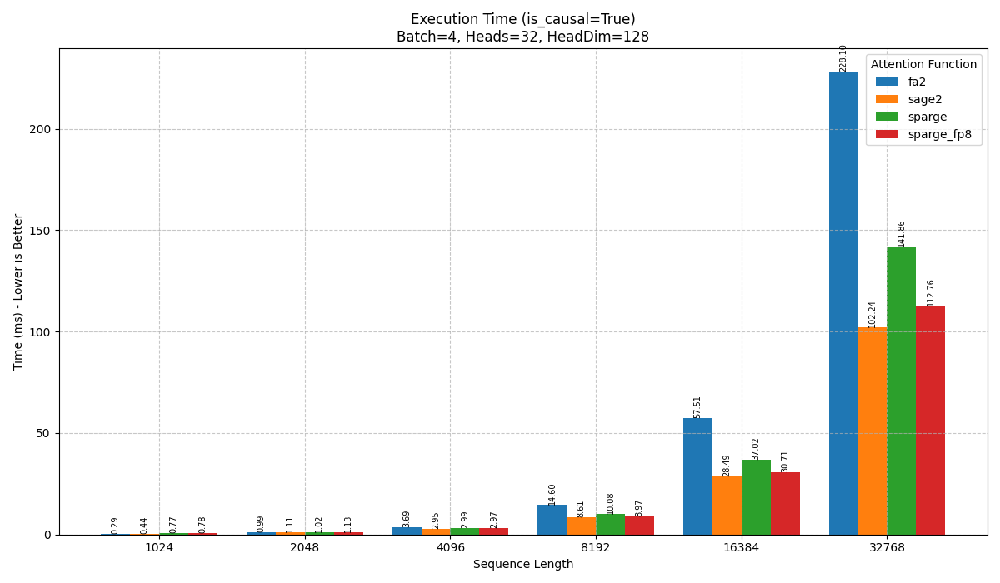
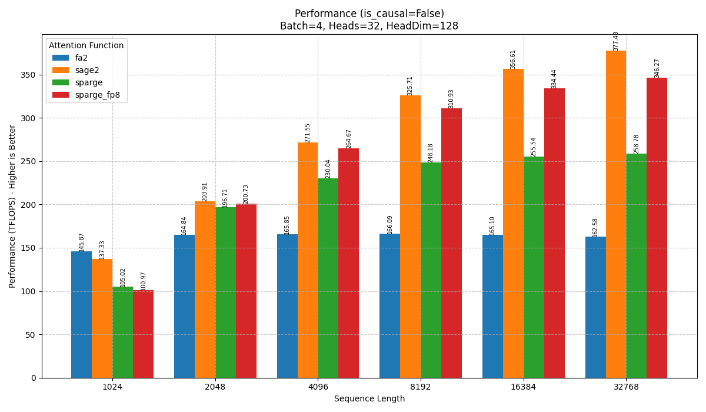
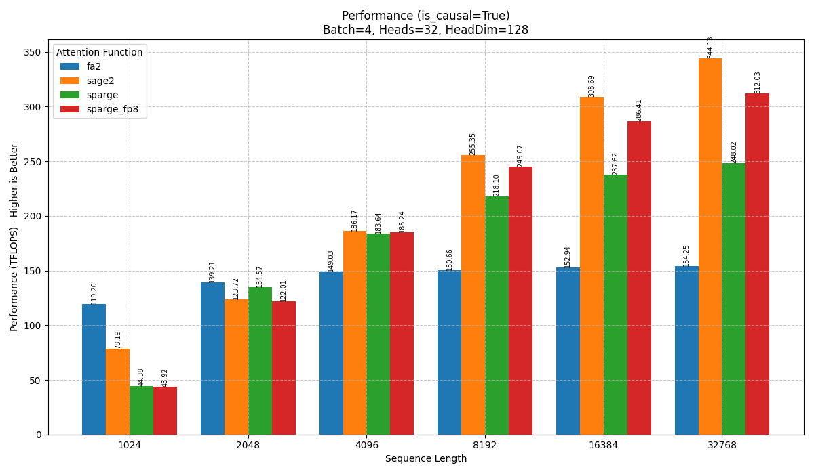

#### Sparsity 30%

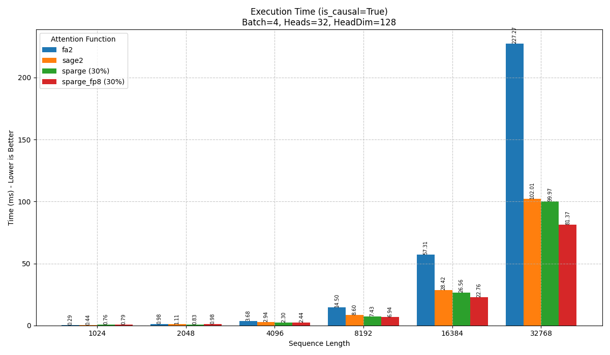
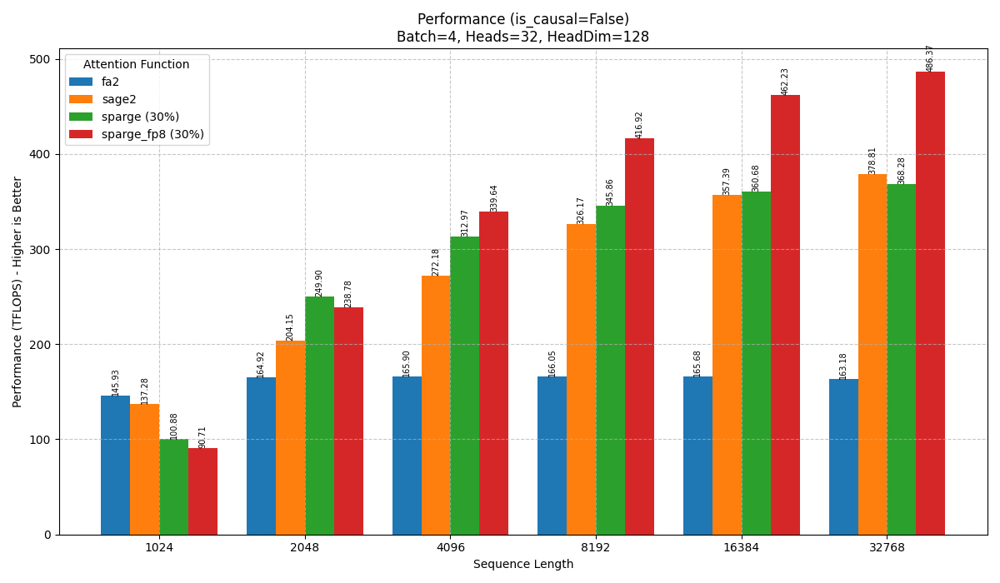
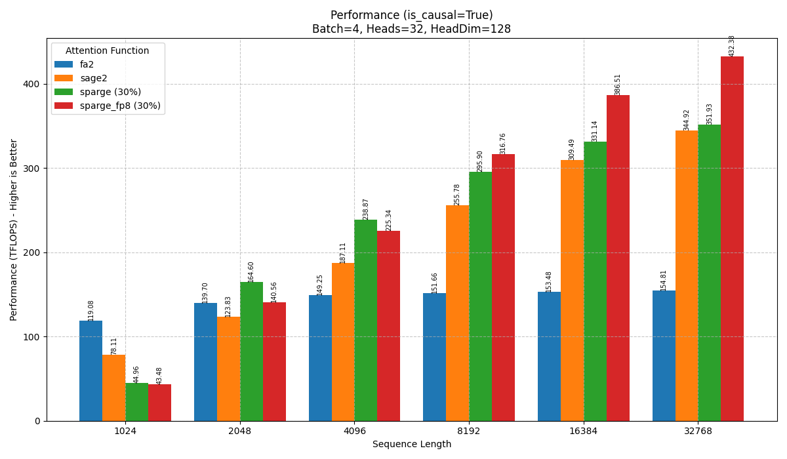

### Benchmark Sequence Sparsity
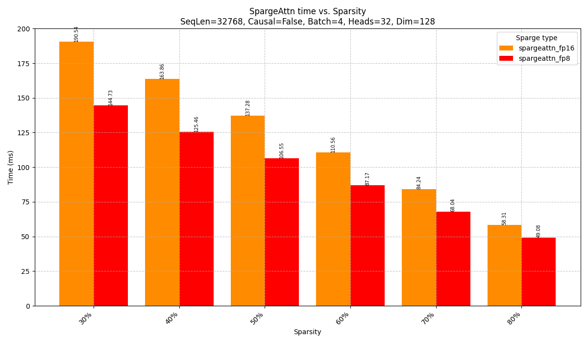
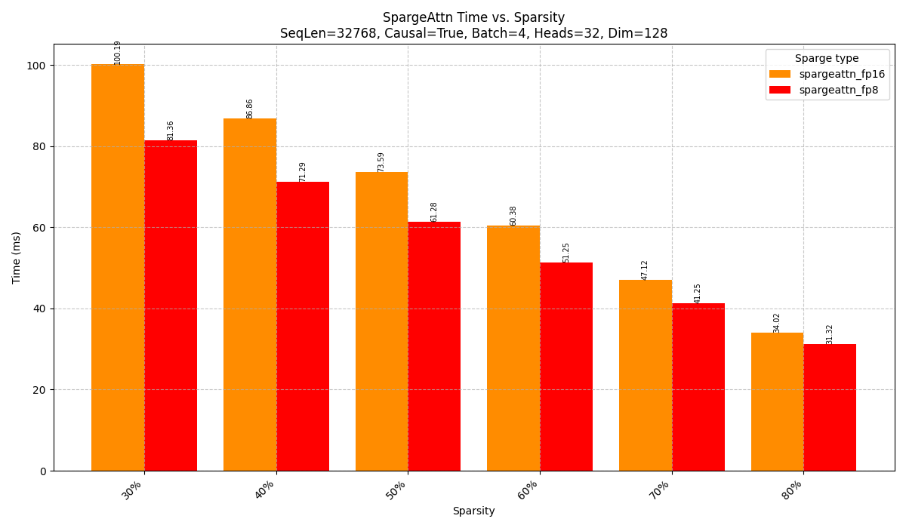
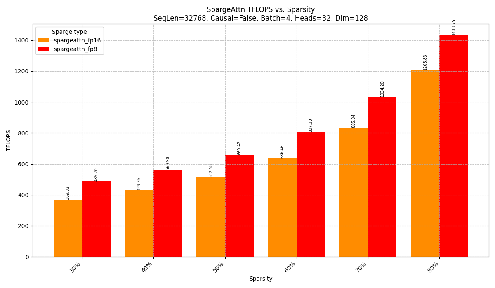
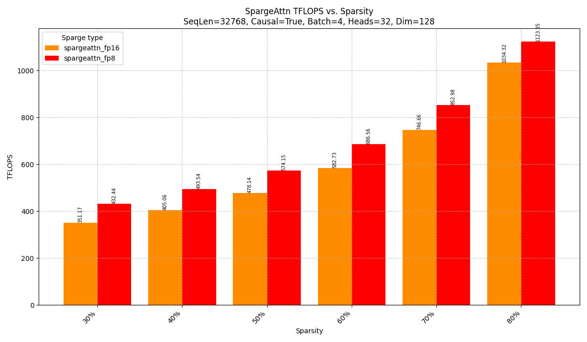

## 测试

```bash
python benchmark_end2end.py --compile --attention_type sdpa
python benchmark_end2end.py --compile --attention_type fa
python benchmark_end2end.py --compile --attention_type sage2
python benchmark_end2end.py --compile --attention_type sparge
python benchmark_end2end.py --compile --attention_type sparge_fp8

# sta 目前官方只有 Hopper 架构的实现，4090跑不了

nsys profile -t cuda,nvtx -s none -o profile_fa --stats=true --force-overwrite true python benchmark_end2end.py --compile --attention_type fa
nsys profile -t cuda,nvtx -s none -o profile_sage2 --stats=true --force-overwrite true python benchmark_end2end.py --compile --attention_type sage2
nsys profile -t cuda,nvtx -s none -o profile_sparge --stats=true --force-overwrite true python benchmark_end2end.py --compile --attention_type sparge
nsys profile -t cuda,nvtx -s none -o profile_sparge_fp8 --stats=true --force-overwrite true python benchmark_end2end.py --compile --attention_type sparge_fp8
```

## FlashAttn (baseline)

```bash

git clone https://github.com/Dao-AILab/flash-attention.git --recursive
cd flash-attention
git checkout b7d29fb3b79f0b78b1c369a52aaa6628dabfb0d7 # 2.7.2 release

# cd hopper  # 支持 hopper 架构
MAX_JOBS=8 python setup.py install # MAX_JOBS 不设小容易并行编译吃完内存被 kill 掉
```

## SageAttn

```bash
git clone https://github.com/thu-ml/SageAttention.git
cd SageAttention 
python setup.py install
```

## SpargeAttn

```bash
git clone https://github.com/thu-ml/SpargeAttn.git
cd SpargeAttn
python setup.py install
```
